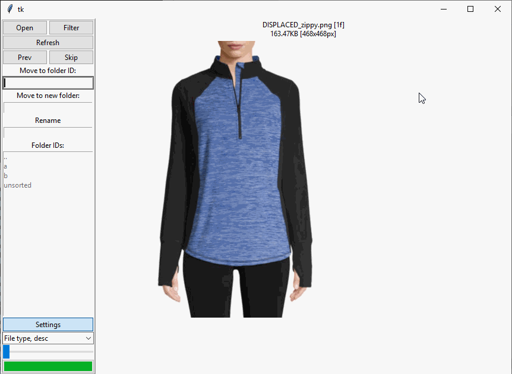

# Sorter

Requires https://github.com/GiovanH/pysnip

## Sort.py



Main GUI. Allows you to sort photos to new or or existing directories, and to rename pictures. Point it a directory `SEL` in a structure such as:

```
.
├── SEL
│   ├── unsorted
│   │    └── Photo.png
│   ├── cat1
│   └── cat2
```

or

```
.
├── Photos
│   ├── SEL
│   │    └── Photo.png
│   ├── cat1
│   └── cat2
```

where your unsorted pictures are next to Photo.png.

